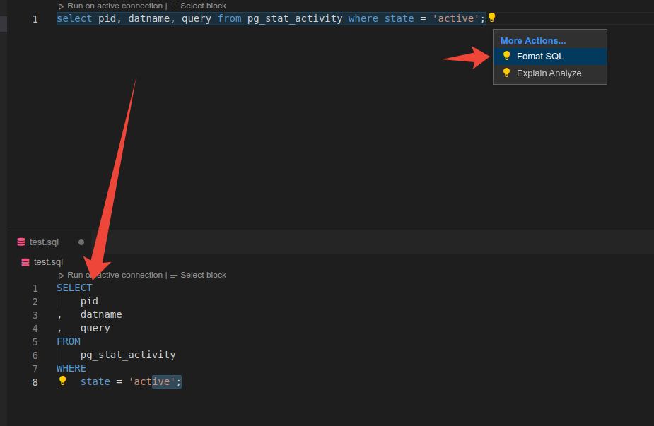
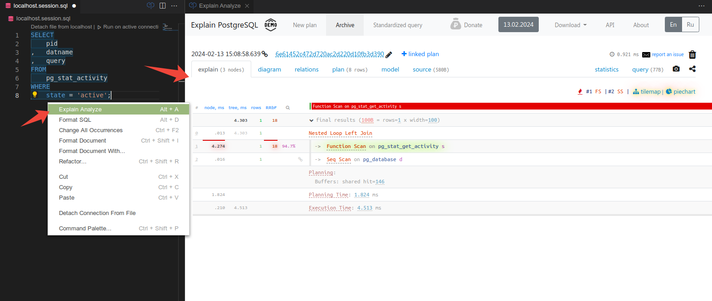
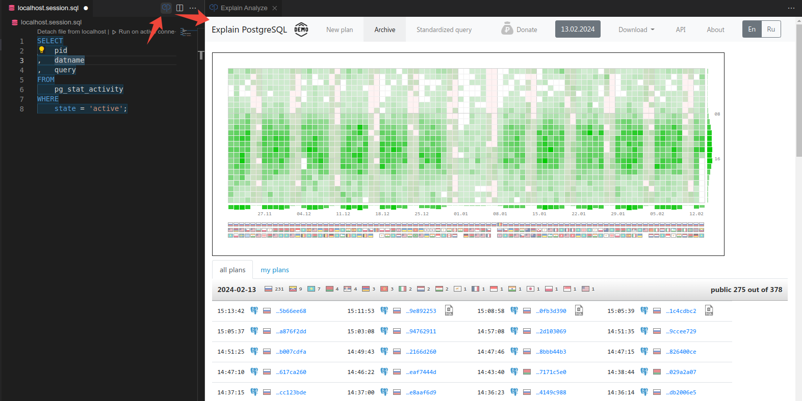
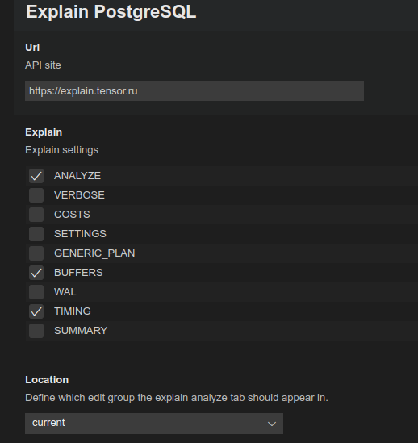

# Explain PostgreSQL for VS Code

Analyzes EXPLAIN plan from PostgreSQL and related (Greenplum, Citus, TimescaleDB and Amazon RedShift).

Shows plan and node details and visualizations with piechart, flowchart and tilemap, also gives smart recommendations to improve query.

Uses the public api from the [explain.tensor.ru](https://explain.tensor.ru/api-description/) , the site can be changed in Settings.

[Learn more](https://explain.tensor.ru/about)

## Features

- Beautifier and formatter for SQL

- Explain Analyze for query plan

- Explain PostgreSQL site in an editor window

## Requirements

This extension depends on [SQLTools](https://vscode-sqltools.mteixeira.dev/)

## Extension Settings

